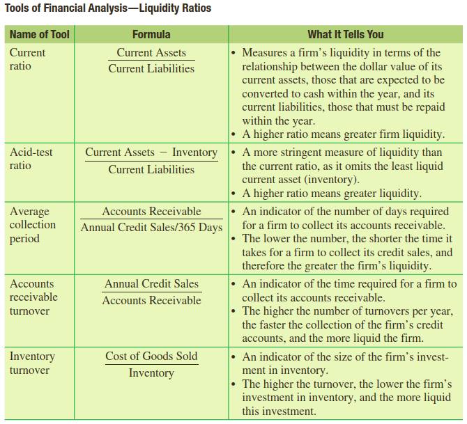
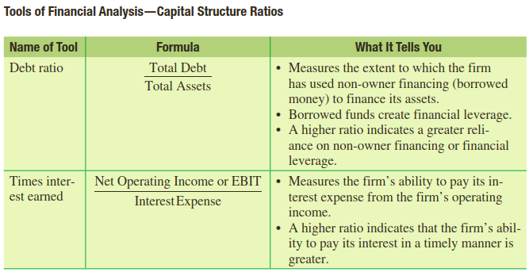
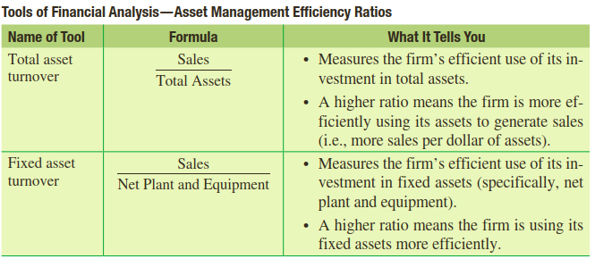
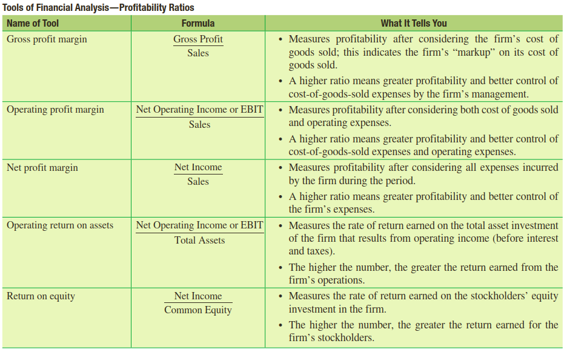
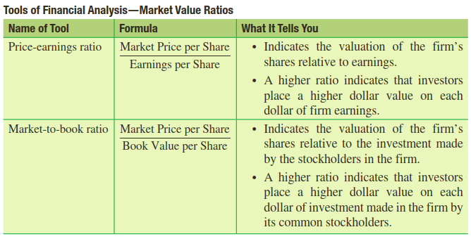

```{r setup, include=FALSE}
knitr::opts_chunk$set(echo = FALSE)
```


### Capaian Pembelajaran

Setelah mempelajari dengan baik materi ini diharapkan mahasiswa dapat:

1. Menjelaskan apa yang diperoleh dari penganalisisan laporan keuangan suatu perusahaan.
2. Menggunakan laporan keuangan common size sebagai alat analisis keuangan.
3. Menghitung dan menggunakan berbagai rasio keuangan yang komprehensif dalam mengevaluasi kinerja suatu perusahaan.
4. Memilih pembanding (benchmark) yang tepat untuk digunakan dalam mengukur kinerja menggunakan analisis rasio keuangan .
5. Menjelaskan keterbatasan analisis rasio keuangan.

### Mengapa analisis Laporan Keuangan penting?

- Analisis Keuangan Internal, untuk:
  - Mengevaluasi kinerja pegawai
  - Membandingkan kinerja divisi yang berbeda
  - Menyiapkan proyeksi keuangan
  - Mengevaluasi kinerja keuangan perusahaan dibandingkan dengan
kompetitor

- Analisis Keuangan Eksternal, dilakukan oleh:
  - Bank
  - Para supplier
  - Agen pemeringkat kredit
  - Analis profesional
  - Investor individu

### Laporan Keuangan Common Size

- Merupakan standarisasi informasi keuangan yang disajikan dalam %
- Membantu membandingkan antara satu perusahaan dengan perusahaan lain
meskipun ukuran ekonomi perusahaan berbeda.
- Cara menyiapkan laporan
- Laporan laba rugi: membagi setiap item dengan sales
- Neraca: membagi setiap item dengan total aset

### Rasio Keuangan

- Menggunakan Laporan Laba Rugi dan Neraca
- Melihat perbandingan
  - Rasio tahun lalu
  - Rasio perusahaan lain yang sejenis
- Rasio keuangan dapat digunakan untuk menjawab pertanyaan-pertanyaan berikut:

```{r, include=FALSE}
library(tidyverse)
library(readxl)
library(kableExtra)
ratio <-  read_excel("C:/Users/Anna/Documents/BLOG-SOURCES/jadwal/4ratio.xlsx")
```

```{r, echo=FALSE}
ratio <- sapply(ratio, as.character)
ratio[is.na(ratio)] <- "" 
ratio %>%
  kbl() %>%
  kable_paper("hover", full_width = F)
```

`Sumber: Titman, Sheridan, Arthur J. Keown, dan John D. Martin (2021)`

---

### 1. Rasio Likuiditas (*Liquidity Ratio*)

- Mengukur kemampuan perusahaan untuk membayar utang-utangnya tepat waktu
- Ada 2 perspektif:
  - Likuiditas Keseluruhan: membandingkan aset lancar (current asset) dengan liabilitas lancar (current liabilities).
  - Likuiditas atas Aset Tertentu: menilai mana saja aset likuid perusahaan yang dapat segera diubah menjadi kas, ex: Account Receivable, Inventory.
  
```{r out.width="100%", echo=FALSE}

```
`Sumber: Titman, Sheridan, Arthur J. Keown, dan John D. Martin (2021)`

### 2. Capital Structure Ratios

```{r out.width="100%", echo=FALSE}

```
`Sumber: Titman, Sheridan, Arthur J. Keown, dan John D. Martin (2021)`


### 3. Asset Management Efficiency Ratios


```{r out.width="100%", echo=FALSE}

```
`Sumber: Titman, Sheridan, Arthur J. Keown, dan John D. Martin (2021)`

### 4. Profitability Ratios


```{r out.width="100%", echo=FALSE}

```
`Sumber: Titman, Sheridan, Arthur J. Keown, dan John D. Martin (2021)`

### 5. Market Value Ratios


```{r out.width="100%", echo=FALSE}

```
`Sumber: Titman, Sheridan, Arthur J. Keown, dan John D. Martin (2021)`

---

### Keterbatasan Analisis Rasio

1. Picking an industry benchmark can sometimes be difficult
2. Published peer-group or industry averages are not always representative of the firm
being analysed.
3. An industry average is not necessarily a desirable target ratio or norm.
4. Accounting practices differ widely among firms.
5. Many firms experience seasonal changes in their operations. 
6. Understanding the numbers.
7. The results of a ratio analysis are no better than the quality of the financial statements.


<!-- AddToAny BEGIN -->
<div class="a2a_kit a2a_kit_size_16 a2a_default_style"; data-a2a-url="https://bangtedy.github.io/menkeu" data-a2a-title="Memahami Laporan Keuangan">
<a class="a2a_button_whatsapp"></a>
<a class="a2a_button_telegram"></a>
<a class="a2a_button_facebook"></a>
<a class="a2a_button_twitter"></a>
</div>
<script async src="https://static.addtoany.com/menu/page.js"></script>
<!-- AddToAny END -->

